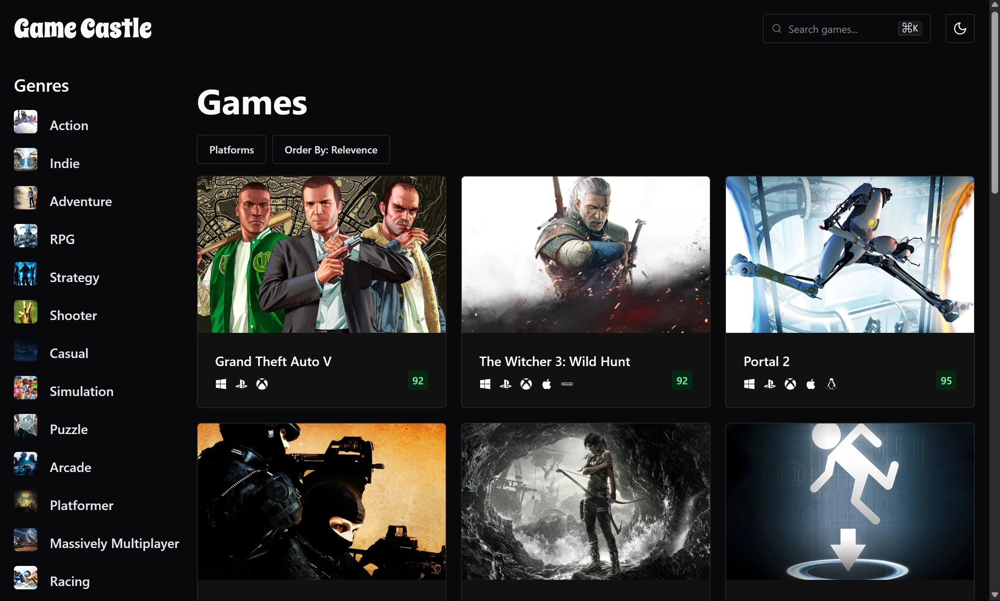
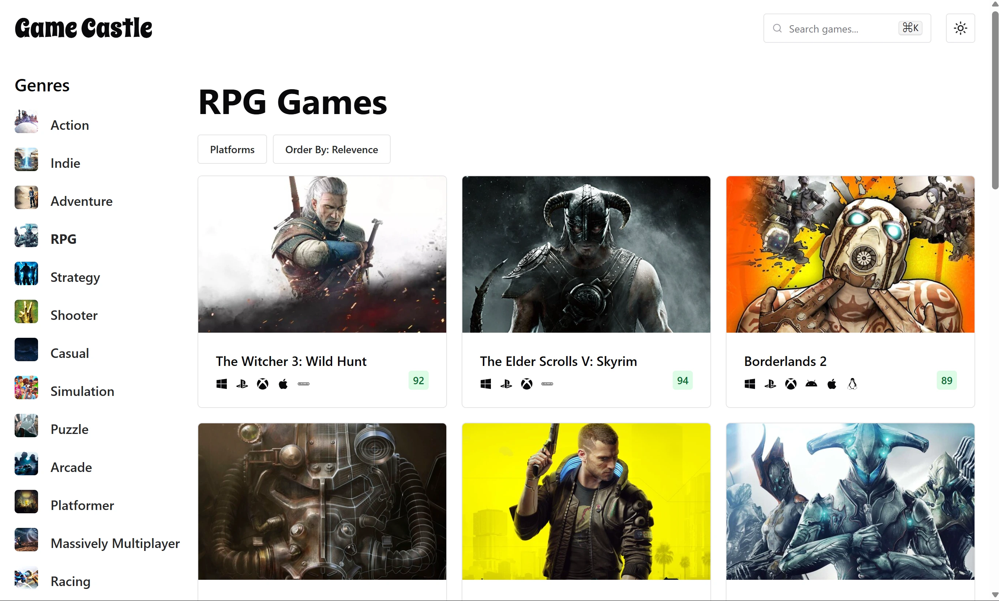

# Game Castle

Game Castle is a modern and fully responsive game discovery web application inspired by the RAWG website. It allows users to explore video games with powerful filters and search capabilities.

## 🚀 Features

- **Game Data** powered by the [RAWG API](https://rawg.io/apidocs)  
- **Genre, Platform, and Ordering Filters** to customize game discovery  
- **Search Functionality** for quick access to games  
- **Dark & Light Theme** for better user experience  
- **Responsive Design** using [Chakra UI](https://chakra-ui.com/)  
- **Efficient Data Fetching & Caching** with [React Query](https://tanstack.com/query/latest)  
- **State Management** with [Zustand](https://github.com/pmndrs/zustand) for a simplified global state 

## 🛠️ Built With

- [Vite](https://vitejs.dev/) + [TypeScript](https://www.typescriptlang.org/)
- [Chakra UI](https://chakra-ui.com/) for styling
- [RAWG API](https://rawg.io/apidocs) for game data
- [React Query](https://tanstack.com/query/latest) for Data Fetching & Caching
- [Zustand](https://github.com/pmndrs/zustand) for state management
- [Vercel](https://vercel.com/) for deployment

## 🚀 Deployment

Game Castle is deployed on **Vercel** for fast and reliable performance.

## 🔧 Getting Started

### Prerequisites

- Node.js (>= 16)
- npm or yarn

### Installation

1. Clone the repository:
   ```sh
   git clone https://github.com/yourusername/game-castle.git
   cd game-castle
   ```
2. Install dependencies:
   ```sh
   npm install
   # or
   yarn install
   ```
3. Create a `.env` file and add your RAWG API key:
   ```env
   VITE_RAWG_API_KEY=your_api_key_here
   ```
4. Start the development server:
   ```sh
   npm run dev
   # or
   yarn dev
   ```
5. Open the app in your browser at `http://localhost:5173`

## 📸 Screenshots




## 🤝 Contributing

Pull requests are welcome! Feel free to contribute and improve the project.

## 📜 License

This project is licensed under the MIT License.

## 🌟 Acknowledgements

- [RAWG API](https://rawg.io/apidocs) for providing game data
- [Chakra UI](https://chakra-ui.com/) for an amazing UI framework

---

Enjoy using **Game Castle**! 🎮🏰
